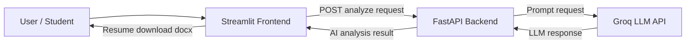

# InternHub – AI Internship Matching System

## 📌 Overview
InternHub is a simple AI-powered internship matching system built as part of the **Track 2: AI Assignment (InternHub – Basic)**.  
The system uses a Large Language Model (LLM) to analyze a student profile and an internship description, and then provides intelligent insights such as match summary, skill gap analysis, resume generation, and an ATS confidence score.

The project focuses on **AI reasoning and prompt design** rather than complex UI or backend systems.

---

## 🚀 What I Built
I built a minimal AI-powered feature that:

- Accepts a **student profile** (skills, interests, experience)
- Accepts an **internship description**
- Uses an **LLM (via Groq API)** to generate:
  - Internship match summary
  - Skill gap explanation
  - Improvement recommendations
  - A **tailored resume**
  - ATS confidence score
- Allows users to **download the generated resume as an editable Word (.docx) file**

---

## ⚙️ How It Works
1. The user enters profile details and internship description using a **Streamlit frontend**.
2. The frontend sends the data to a **FastAPI backend**.
3. The backend:
   - Constructs a structured prompt
   - Sends it to the Groq LLM
   - Receives a generated response
4. The AI response is sent back to the frontend.
5. The frontend:
   - Displays the AI analysis
   - Extracts the resume section
   - Converts it into a `.docx` file using `python-docx`
   - Allows the user to download and edit the resume

---

## 🧠 AI Design Approach
- Prompt-based reasoning using structured instructions
- Delimiter-based and fallback extraction to handle LLM variability
- Focus on explainability and real-world usability

---
## 🏗️ System Architecture

## 🛠 Tech Stack Used

### Backend
- **FastAPI** – Lightweight REST API
- **Groq API** – LLM inference (LLaMA-based models)
- **Python**

### Frontend
- **Streamlit** – Minimal UI for AI interaction

### Libraries
- `pydantic` – Data validation
- `requests` – API communication
- `python-docx` – Resume export in Word format

### Deployment
- **Backend**: Render
- **Frontend**: Streamlit Cloud

---

## 📌 Assumptions Made
- No authentication is required
- No database is used (stateless system)
- Resume quality depends on the LLM output
- ATS score is heuristic-based, not from a real ATS engine
- The application is designed for demo and evaluation purposes

---

## 👤 Author Details
- **Name:** Janmejay Pandya
- **Enrollment Number:** 22070122086
- **Batch:** 2022-2026
- **University:** Symbiosis Institute of Technology, Pune  
- **Role Applied For:** AI Intern 

---

## 📎 Note
- The backend may take a few seconds to respond initially due to cold start on free hosting.
- The generated resume is fully editable after download.

---

